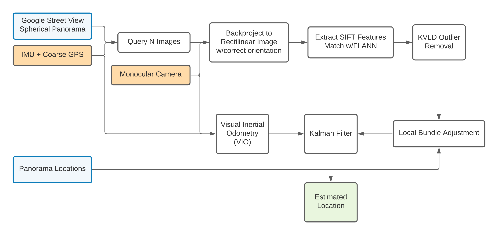

# Monocular Street View Localization

## Dependencies

While not all modules require the same dependencies, the following is required to run the complete project:

- Python Version >= 3.7
- The Python modules from PyPi listed in `requirements.txt`. Run `pip install -r requirments.txt` to install.
- A fork of openMVG found [here](https://github.com/alexanderswerdlow/openMVG). This is required to use the kVLD filtering and requires compilation of openMVG. Instructions on how to do so are listed [here](https://github.com/alexanderswerdlow/openMVG/blob/develop/BUILD.md) and vary based on your system. Once compiled, you must change `OPENMVG_SFM_BIN` in config.py to point to your build directory.

Once the required dependencies are installed, you must modify `config.py` to correspond to the desired paths for your system. All modules paths defined in `config.py` to know where to load/save data. Specifically, `data_dir` should contain a subfolder `images` with the downloaded panoramas. These can be retrieved by setting the `API_KEY` in `config.py` and running `python3 download_panoramas.py`. Next, you must set `recording_dir` to the directory containing the recorded video files and metadata.

We used [ios_logger](https://github.com/Varvrar/ios_logger) to record camera frames and IMU data for offline testing. This program is not dependent on `ios_logger` but the `preprocess_datalog.py` script expects data in the format described in the `ios_logger` repo. `preprocess_datalog.py` processes these assorted text files and saves a binary file that simplifies later processing.

## To run the program:

To download panoramas: `python3 download_panoramas.py`

To ingest data: `python3 preprocess_datalog.py`

To produce location estimates: `python3 test_localization.py`

## Overview

Below is a system diagram depicting the primary steps of our pipeline. The paper contains detailed descriptions of the important steps but this section will go over the program architecture, i.e. how they actually run.

We first retrieve tiled panoramas from Google Street View by creating a route consisting of lat/long pairs stored in `waypoints.py`. We treat this as a piecewise linear trajectory and interpolate every n meters in `download_panoramas.py`. These are saved with their associated metadata (location, pano id, depth data, etc.) in the data dir folder. This script (as well as the rest of the project) was designed to be idempotent and resumable. In other words, you can run the program multiple times with no additional effect, or run them partially and resume where you left off, saving prior computations.

`preprocess_datalog.py` takes a folder with a video and associated data files from the phone (IMU, GPS, etc.) and processes the text files into a single binary file for easier parsing. This makes it easier to get the data at any given frame and tie all the data together.

Next, we run `test_localization.py` which does the following at each frame:

- Finds the nearest n GSV panoramas, backprojects onto a sphere and then creates a virtual image from the perspective of the phone camera
- Runs feature matching in `localization/kvld.py` by calling openMVG. This is done by calling a compiled openMVG binary with the correct arguments and parsing the stdout. This performs SIFT, FLANN matching, and kVLD filtering
- Minimizes the reprojection error using a fixed nonlinear solver (SciPy) or through pose graph optimization with g2o or ceres